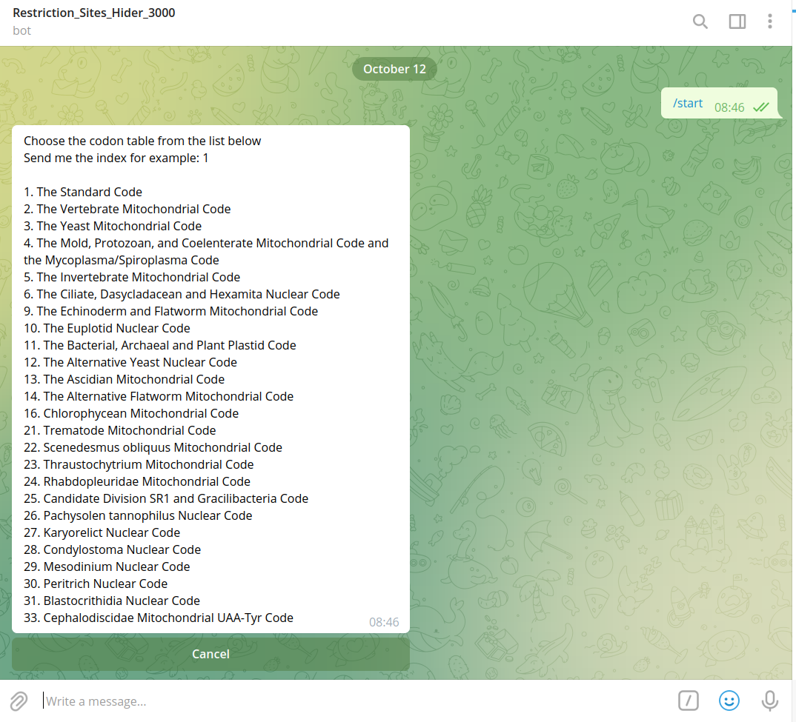
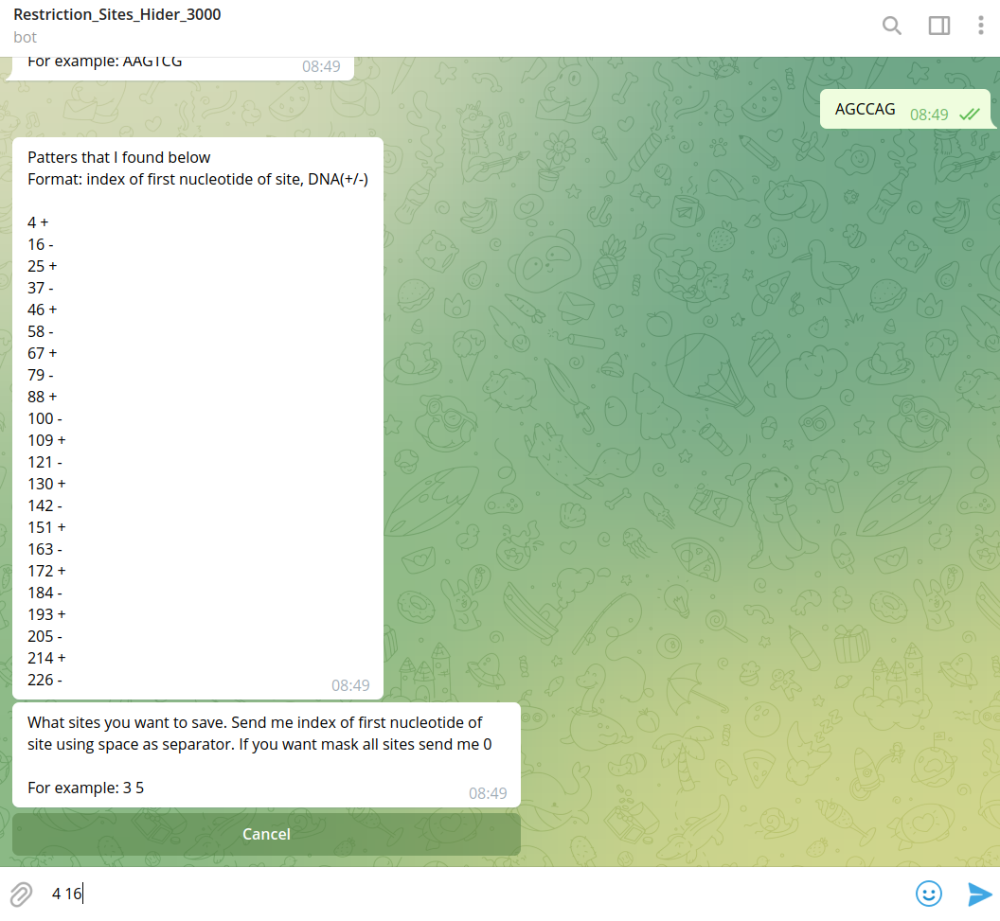

# Restriction_Sites_Hider.py (RSH) also known as Restriction_Sites_Hider_3000 (http://t.me/restriction_sites_hider_3000_BOT)

## Instruction

README.md also exist in PDF format -> [**README.pdf**](https://github.com/trituration/README.pdf)

## Our team

* Anton Tsukanov ubercomrade@gmail.com Institute of Cytology and Genetics of the Siberian Branch of the Russian Academy of Sciences
* Tatiana Kurgina t.a.kurgina@gmail.com Institute of chemical biology and fundamental medicine  Branch of the Russian Academy of Sciences
* Konstantin Ivanov kos.ivanoff2010@yandex.ru University of Eastern Finland
* Georgii Ozhegov georgii_provisor@mail.ru Kazan Federal University

## Requirements

PYTHON:
  * BioPython: `pip install biopython`

## Installation

```
git clone https://github.com/trituration/rsh.git  
cd rsh/  
pip install -e .  
```

 The source code of the telegram bot is located in the `bot` directory. But it not used for script.

## Usage

The command `restriction_sites_hider.py -h` return:

```
usage: restriction_sites_hider.py [-h]
                  {codon_tables,enzymes,find_known_sites,find_by_pattern,remove_sites,remove_by_pattern}
                  ...

positional arguments:
  {codon_tables,enzymes,find_known_sites,find_by_pattern,remove_sites,remove_by_pattern}
                        Available commands:
    codon_tables        Return avalibale codon tables in STDOUT
    enzymes             Return avalibale restriction enzymes in STDOUT
    find_known_sites    Find sites in fasta file for given restriction enzyme
    find_by_pattern     Find sites in fasta file for given restriction enzyme
    remove_known_sites  Return modified FASTA
    remove_by_pattern   Return modified FASTA

optional arguments:
  -h, --help            show this help message and exit
```
Put executable file and database restriction_enzymes_database.tsv in working directory. 
Restriction sites removes in several steps: 
1. Finding all possible restriction sites in user's sequence
2. Choosing restriction sites that must be hided by User
3. Create new fasta file with hided restriction sites. 


### Preparatory steps

1. Chose genetic code table
This programm support different types of genetic code tables. All possible tables user can see by following command:

```
restriction_sites_hider.py codon_tables
```

This command return this table:
```
The Standard Code 1
The Vertebrate Mitochondrial Code 2
The Yeast Mitochondrial Code 3
The Mold, Protozoan, and Coelenterate Mitochondrial Code and the Mycoplasma/Spiroplasma Code 4
The Invertebrate Mitochondrial Code 5
The Ciliate, Dasycladacean and Hexamita Nuclear Code 6
The Echinoderm and Flatworm Mitochondrial Code 9
The Euplotid Nuclear Code 10
The Bacterial, Archaeal and Plant Plastid Code 11
The Alternative Yeast Nuclear Code 12
The Ascidian Mitochondrial Code 13
The Alternative Flatworm Mitochondrial Code 14
Chlorophycean Mitochondrial Code 16
Trematode Mitochondrial Code 21
Scenedesmus obliquus Mitochondrial Code 22
Thraustochytrium Mitochondrial Code 23
Rhabdopleuridae Mitochondrial Code 24
Candidate Division SR1 and Gracilibacteria Code 25
Pachysolen tannophilus Nuclear Code 26
Karyorelict Nuclear Code 27
Condylostoma Nuclear Code 28
Mesodinium Nuclear Code 29
Peritrich Nuclear Code 30
Blastocrithidia Nuclear Code 31
Cephalodiscidae Mitochondrial UAA-Tyr Code 33
```
Standard genetic code is set by defeult. If user want to change it to anyone else he/she should set the number on the right side of the table as input paramter to every function. 

2. User should choose restriction site or restriction enzyme which sites he wants to hide. In this programm used database Rebase v.110. Obtain list of known restriction enzymes by this command:

```
restriction_sites_hider.py enzymes
```
### Restriction sites finding

For restriction sites finding it's possible to use one of the following commands `find_known_sites` or `find_by_pattern`. 
If user knew restriction enzyme name he/she use `find_known_sites` command
For example:
```
restriction_sites_hider.py find_known_sites ./NC_005816.fna YenBI test.txt
```
where `./NC_005816.fna` - original fasta, `YenBI` - enzyme's name and `test.txt` - output file

If user don't know restriction enzyme name or it's not present in database - use `find_by_pattern`
For example:
```
restriction_sites_hider.py find_by_pattern ./NC_005816.fna AGCCAG test.txt
```
where `./NC_005816.fna` - original fasta, `AGCCAG` - restriction site and `test.txt` - output file

Additional arguments are:
```
-m MIN, --min MIN - minimal protein length that coded in ORF
-c CODONE, --codone CODONE - index of genetic code table
```

###  Choose restriction sites to hide by user

Output from previous command `find_known_sites` or `find_by_pattern` (for example `test.txt`) contain table that look like:
```
pos strand  site  region  codone_pos
6899  + GGATCC  in_coding_region  6900
7312  + GGATCC  in_noncoding_region  7312
```

where 
`pos` - start of restrictions site
`strand` - + or - strand of DNA
`site` - site that finds 
`region` - show is this restriction site in ORF or not

If you don't want to hide some of sites just delete string that conatin it from this file. All remaining sites will be hided.

### Sites hiding

For hiding restriction sites usr should use one of the following commands: `remove_known_sites` or `remove_by_pattern`. 
Choose same command as you used for Restriction sites finding

For example:
```
restriction_sites_hider.py remove_by_pattern ./NC_005816.fna test.txt AGCCAG new_fasta.fa
```
where 
`./NC_005816.fna` is the same fasta file that used for command `python program.py find_by_pattern`
`test.txt` - output from `python program.py find_by_pattern` (optionally edited by user)
`AGCCAG` - restriction enzyme site (same as used for previous command)
`new_fasta.fa` - new fasta file with hided restrictions sites

Another example:
```
restriction_sites_hider.py remove_known_sites ./NC_005816.fna test.txt YenBI new_fasta.fa
```

### Example run

Example data (fasta file of plasmid) and bash script avalibale in `example` directory
In this directoty just run:

```
chmod + x ./example.sh
./example.sh
```

## Below described instruction to Teleram bot (http://t.me/restriction_sites_hider_3000_BOT)

This bot hiding restriction sites by users choice. Based on restriction_sites_hider.py (https://github.com/trituration/rsh). 


1. If you want to start, just send /start or press the start link.


2. Bot will ask you to choose the codon table which supposed to be used



3. Upload your sequence txt file as plain text or FASTA format. Bot support only DNA fasta with 1 sequence. MultiFasta will work in an unforeseen way.


4. Enter site of restriction by typing it as message. You could use upper and lower case. 


5. Choose site or sites which you want to save. 



6. Choose open reading frame. 


7. Your result is ready, you are wonderful!

